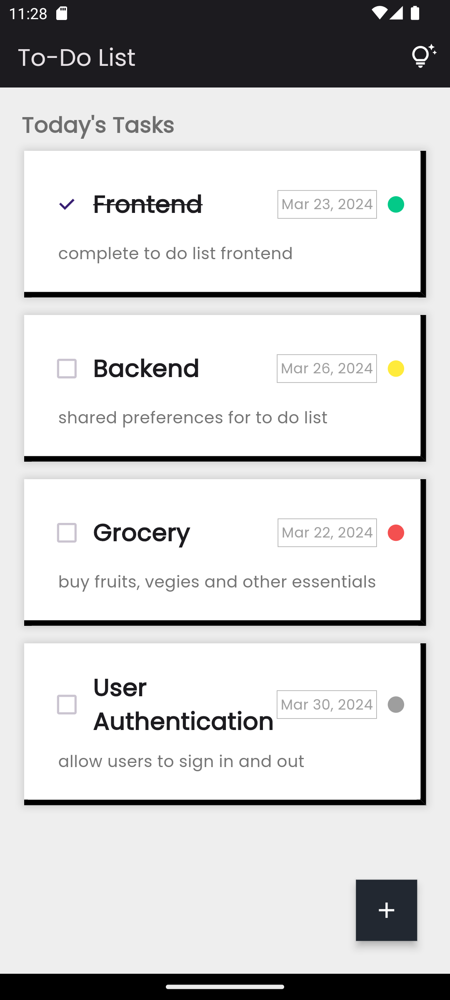

# Flutter Todo List App

Welcome to the Flutter Todo List App! This is a simple todo list application built using Flutter and Dart. With this app, users can manage their tasks easily by adding, editing, and deleting them. Please note that this app is currently only a UI prototype and does not save tasks due to the absence of a backend server.

# Output

    
    
    
    
    

